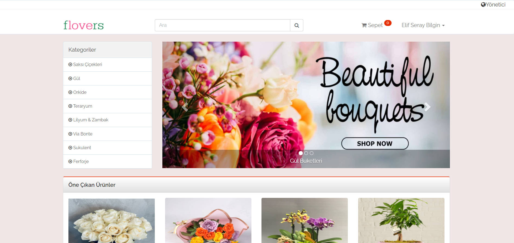
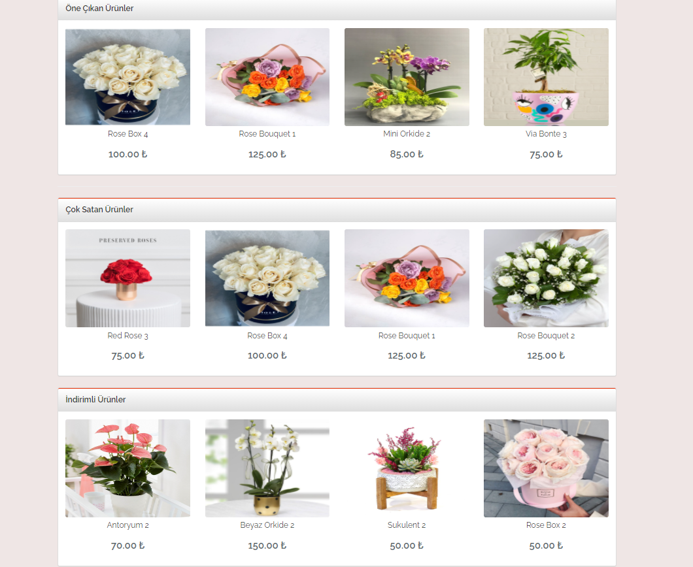
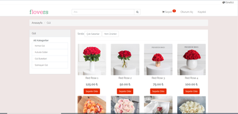
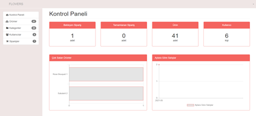

# E-Ticaret
Web Programlama

## Kurulum
- Kodları bilgisayarınıza indirin veya klonlayın.
- Konsol ekranında `composer install` komutunu çalıştırın.
- .env.example dosyasının adını .env olarak değiştirin.
- .env dosyası içerisinde yer alan `DB_` parametrelerini kendinize göre ayarlayın.
- Konsol ekranında `php artisan key:generate` komutunu çalıştırın.
- Projeyi çalıştırmak için `php artisan serve` komutunu çalıştırın.

### Ana Sayfa

### Kategori

### Yönetici

